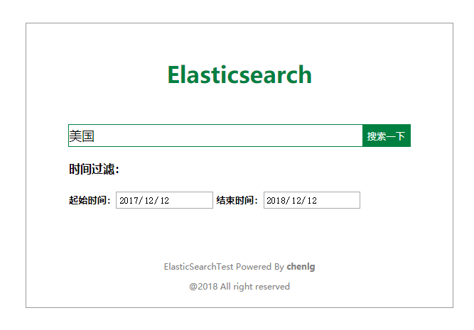
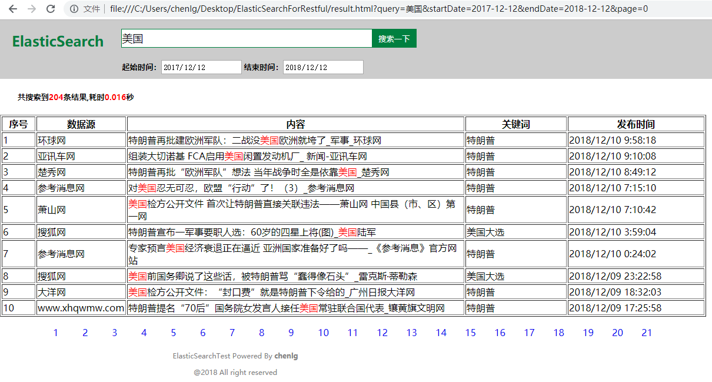

# 1 引言
该程序根据ES的restful api写的一个检索示例，使用AJAX构建post请求进行检索，所以该示例就只有两个前端页面。
# 2 使用
直接用浏览器打开index.html文件即可使用，具体检索的索引信息见result.html页面代码。
# 3 效果展示
## 3.1 查询首页

  

## 3.2 查询结果

  

#4 参考资料
《从lucene到elasticsearch全文检索实战》
